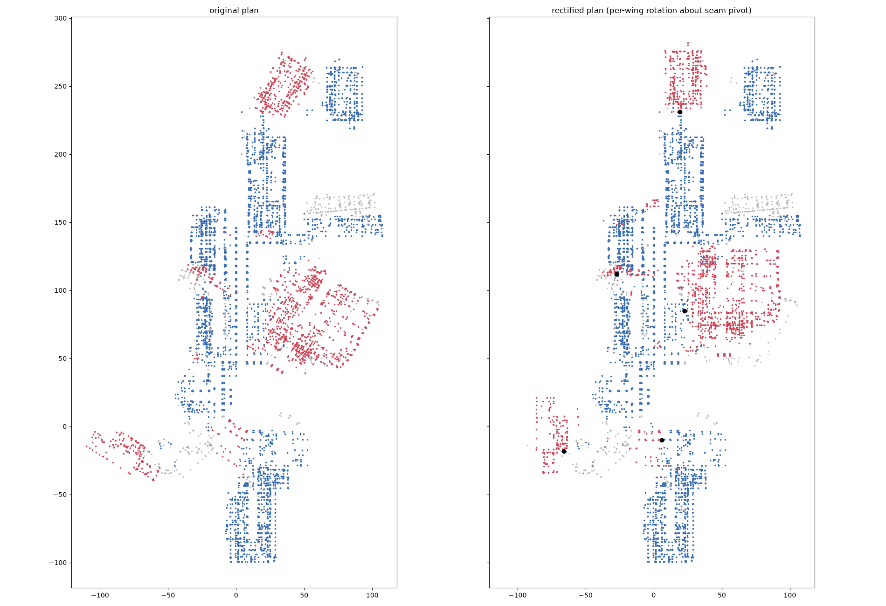
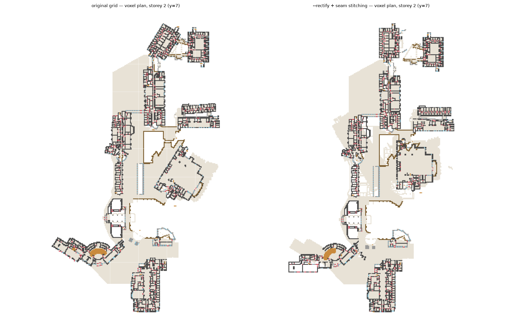

# Plan rectification: making the building conform to the voxel grid

The idea (proposed by the project owner): instead of voxelizing the building
exactly where it stands, first look at **each floor's layout** — walls,
corridors, rooms — and *rectify* it into shapes that can exist cleanly in
Minecraft (axis-aligned walls, straight corridors), then put the attached
elements (doors, windows) back **relative to the walls they belong to**.

Short answer: **yes, this makes sense, it is the right long-term move, and
the literature backs the exact mechanism** — but it should be done per
*wing*, not per wall, and openings must be stored parametrically before any
geometry moves. Below: the evidence, the algorithm, and an honest cost
estimate.

## Why the current output has diagonal artifacts

Measured from the IFC placements (14,902 walls):

| plan angle (mod 90°) | walls | share |
|---|---|---|
| 0° (axis-aligned) | 9,678 | **65 %** |
| 58° | 3,564 | **24 %** |
| 5° | 351 | 2.4 % |
| 60° | 257 | 1.7 % |
| everything else | ~1,050 | ~7 % |

So this is not "a few skewed walls": **an entire wing of the campus sits at
58° to the main grid.** Inside that wing the architecture is perfectly
orthogonal *in its own frame* — its corridors meet at right angles — but on
our grid every one of its walls voxelizes as a jagged staircase line,
corridors pinch and bulge, and doors sit in stepped wall segments (several
of the "outside doors that don't make sense" live on these facades).

## What others do (research summary — full sources in the PR discussion)

- **City-scale Minecraft imports** (Denmark in Minecraft, GeoCraft NL,
  Blockholm) don't rectify at all: they rasterize footprints and accept
  jagged diagonals, and none place functional doors. Rectification is the
  differentiator no one has built.
- **OSM/JOSM "orthogonalize"** and its Python re-implementations are the
  standard footprint-squaring recipe: rotate to the dominant edge direction,
  snap near-axis segments to 0°/90° within a tolerance band, keep genuine
  diagonals. Cartographic squaring (Lokhat & Touya) does the same as a
  soft least-squares problem so lengths and topology survive.
- **Voxel escape-route research** (Autodesk VASA; Gorte et al.; voxec) gives
  the acceptance test: walkable(c→c') iff Δh ≤ 1 step and headroom ≥ agent
  height; a stairwell is correct iff its walkable layer is one connected
  component from landing to landing. We already enforce this post-hoc; a
  rectified plan should be *verified* with the same rule, not assumed fine.

## The algorithm (proposed)

Phase 0 is cheap and buys most of the value; each later phase is optional.

**Phase 0 — global grid choice (hours).** Histogram wall angles (done,
above), rotate the *whole model* so the dominant cluster lands on 0°. UNBC
is already dominant-aligned, so this is a no-op here — but it's the first
thing to run on any new IFC.

**Phase 1 — wing segmentation + per-wing frames (days).** Cluster elements
by wall-angle families and spatial contiguity (the 58° wing separates
cleanly). Voxelize each wing **in its own rotated frame**, where it is
orthogonal, then place each wing's voxel block into the world at a snapped
(axis-aligned) offset. Result: every corridor and wall in both wings is
clean; the *seams* between wings are the only distorted zones.

**Phase 2 — seam stitching (days, the hard part).** Where the wings meet,
re-run corridor/door logic in a buffer zone: identify IfcDoors and corridor
spaces crossing the seam, and synthesize a straight connecting hall between
the two grids (same spirit as the stairwell switchback rebuild — a clean
synthetic connector beats a faithful-but-broken voxelization).

**Phase 3 — true per-floor schematization (weeks, research-grade).** Extract
each storey's wall centerline graph, JOSM-style snap near-axis segments
(tolerance ~10–15°) with soft least-squares so corridor widths ≥ 2 blocks
and room adjacency are preserved, then re-voxelize from the rectified graph.
This is the full version of the owner's idea; it subsumes Phases 1–2 but
carries real topology risk.

**Openings replay (needed from Phase 1 on).** Before any geometry moves,
record every door/window **parametrically**:
`(host wall id, t ∈ [0,1] along the wall centerline, sill height, width,
swing side)` — all available from IFC (`FillsVoids` → opening → wall). After
rectification, re-instantiate each opening on the *moved* wall at the same
t and sill. Our existing sill-anchored door placer already is the replay
half; the parametric recording is new but small. This is exactly the
constraint-re-anchoring idea from cartographic generalization, and it is
what "put back the elements relative to where they were connected" means
formally.

**Verification (unchanged).** After any phase: the vanilla-physics
reachability audit (every storey's floor cells reachable from the entrance)
plus the per-door two-sided walkability probe. Rectification that breaks a
door slides it along its wall to the nearest valid column (GDMC-style
validity rule) rather than deleting it.

## Looking at it before converting

```sh
make rectify-preview IFC="model.ifc"
python3 scripts/preview_rectify.py model.rvt      # parses the RVT first
python3 scripts/preview_rectify.py --self-test    # needs no model
```

It takes a `.rvt` as well as an `.ifc`. Rectification reads walls and nothing
else, so it is the one stage that works off an RVT recovery whether or not that
recovery's IFC would clear the voxel engine's contract.

The two figures above are the real campus from a real run, and they are better
evidence than any synthetic check. What they are not is reproducible: they were
committed with Phase 1 and no generator went with them, so they cannot be
re-made after an engine change, re-run at a different pitch, or pointed at
another model — including an IFC recovered from the RVT by the parser in
`parsers/reviter` rather than exported by Revit.

`compute_wing_transforms` reads IFC wall **placements**
and nothing else: no geometry, no meshing. `preview_rectify.py` runs the
identical function the engine runs and draws the answer as a before/after plan —
each wing in its own colour, the on-grid spine in grey — plus the per-wing
rotation, pivot, shove, and the count of wing walls within 2 m of the spine
before and against after. Its `--json` is the same `wing_records` shape
`--rectify` writes into `summary.json`, so a preview and a real build compare
field by field.

Two things to know when reading the picture. Membership is a convex-hull test,
so an axis-aligned wall that happens to sit inside a wing's hull belongs to that
wing and moves with it — grey inside a coloured cloud is not a mistake. And the
walls that belong to no wing are **two** populations, not one: already on the
grid, and off-grid with an angle family too small or too scattered to cluster.
The second kind does not move and does voxelize as a jagged line, so it is drawn
and counted separately. On UNBC that is roughly 7% of walls; the committed
figure above shows the same three populations.

The preview covers Phase 1 only. Seam stitching runs later against the voxel
grid and cannot be known from placements.

### Reading the walls: two producers, one silent failure

`compute_wing_transforms` read wall positions from `IfcLocalPlacement`. That
works for Revit's own exporter, which gives every wall its own placement. It
does not work for an RVT recovery: **Reviter puts every product on one shared
placement and bakes world coordinates into the geometry**, so all 600 walls of a
test building read as sitting at one point at zero degrees. The pass then found
100% axis-aligned walls, no off-axis family, and **no wings** — `--rectify`
became a no-op that reported success.

Measured on the same two-grid building through both producers:

| read from | walls | axis-aligned | wings found |
|---|---:|---:|---:|
| per-element placements | 600 | 300 (50%) | 1 |
| one shared placement, before the fix | 600 | **600 (100%)** | **0** |
| one shared placement, footprints | 600 | 300 (50%) | 1 |

`wall_plan` now uses the placements only when they actually distinguish the
walls, and reads each wall's footprint otherwise — its plan centroid, and its
first principal axis as the angle. Footprints come straight off
`IfcTriangulatedFaceSet`/`IfcPolygonalFaceSet` coordinate lists, so this costs
attribute access rather than a mesh. A file that offers neither now says so
instead of returning a perfectly grid-aligned building.

### Measured on the real model

The UNBC IFC (`adb85a6f…`, the file every dated audit here was written
against) through `preview_rectify.py`, in 34 seconds:

```
14,902 walls, read from per-element placements; 9,684 axis-aligned (65%)
6 wings: four at +32 deg, one at -58, one at -5      5,066 walls (34%) move
```

That is this repository's own headline reproduced by a tool that did not exist
when it was written — 65% axis-aligned, six wings, five from the 58 degree
family and one 5 degree skew — which is the first independent confirmation
either number has had.

The costs, which had never been measured per wall:

| | walls |
|---|---:|
| already on the grid, rotated OFF it by a wing's hull | **523** |
| within 2 m of the spine or another wing afterwards | 104 |
| touching the spine before, clear of it after (the stitcher's work) | 89 |

**On the reconciliation with the 27 below.** That figure and this 104 are not
the same measurement and should not be read against each other. RECTIFY.md
measures wall centres within **1 m**; `clipping()` uses 2 m. At 1 m, and
excluding on-grid walls that sit inside a wing's hull and therefore travel with
it, the same run gives **82 rotation-only → 36 after the push-apart**, against
the 104 → 27 recorded below. Same direction, same rough halving, different
denominators; the residual gap is the hull-membership correction and has not
been chased further.

### Converted, both ways, and what the percentage hides

The real model at 1 m, faithful against `--rectify`:

| | faithful | `--rectify` |
|---|---:|---:|
| interior cells reachable | **36,813** | 35,054 |
| interior cells standable | 39,409 | 38,924 |
| share | **93.4%** | 90.1% |
| cut off | 2,596 in 10 pockets | 3,870 |
| largest cut-off pocket | 362 cells | **1,376 cells** |
| interior cells open to sky | 841 | **390** |
| interior cells that see straight out | **603 (1.6%)** | 845 (2.4%) |
| outdoor cells reachable | 29,760 through 182 openings | 29,770 through 169 |
| stairwells ISOLATED | **0** | 2 |

**Rectification buys a cleaner envelope overhead and pays for it on the
ground.** It halves the holes in the roof (841 to 390), and it strands a
1,381-cell region the faithful build does not, leaks twice as much sideways,
and leaves two stairwells unreachable where the faithful build leaves none.

Quote the counts, or quote both. A single percentage across two builds with
different denominators is the same mistake as measuring wing clipping against a
spine that moves with the wing.

> An earlier version of this table read `44,917` reachable against `42,020` and
> concluded rectification *reached ~2,900 more cells*. Both columns were
> inflated by `cap_envelope` roofing over open terrace, and the rectified one
> further by wings whose walls had left their floors behind — the bare plates
> counted as interior. Two fixes later the sign of the comparison changed. A
> number measured through a broken classifier is not a small error.

The stranded pocket is the actionable half, and it exists only in the rectified
build: until `inspect_interior.py` located it, the whole of it was hidden inside
a three-point difference in a percentage. Walked to, it is a furnished interior
— walls, a ceiling, a lit corridor receding at 90 degrees — not a rounding
sliver.

### The wing membership rule, and what it cost

`wing_for_point` decided an element's wing from its CENTROID. Right for a wall,
wrong for a floor slab, which spans the wing and the spine so its centroid falls
outside the hull. Measured per hull on the real model: **90-99% of the walls
touching each hull rotated, against 25-78% of the plates.** The wing's walls
swung 32 or 58 degrees away and the floor they stood on stayed exactly where it
was. Wall voxels fell 3.4% and glass 5% while floor voxels barely moved.

`apply_wings_piecewise` assigns per triangle instead: a mesh whose vertices
disagree is subdivided below half a metre, and each triangle goes wholly with
the wing its own centroid falls in, so the plate tears at the hull and its wing
half travels with the wing. Aggregates still move whole — a stair's flights,
stringers and railings have to arrive together.

| | centroid | per triangle | + seam walls |
|---|---:|---:|---:|
| interior cells that see straight out | 4,240 (10.7%) | 1,145 (3.2%) | **845 (2.4%)** |
| of those, NOT open in the faithful build | — | 707 | **431** |
| largest such cluster | 718 cells | **159** | 159 |
| holes in the envelope | 1,828 | **390** | 390 |
| floor holes the patcher had to fill | 1,840 | **675** | 675 |
| columns `cap_envelope` had to roof | 1,513 | **642** | 642 |

### The hull is a population, and the facade is not in it

`wall_plan` builds every wing hull from `IfcWall` and `IfcWallStandardCase`
placements. A curtain wall is neither: its panels (`IfcPlate`) and mullions
(`IfcMember`) are their own elements hanging on the facade, so the hull never
encloses them. The wall behind the glazing rotates 32 degrees and the glazing
stays, driven through the rooms that moved — 433 of the 638 things the move
leaves behind, audited floor by floor in the parser's own architectural plan.

`adjacency_claims` claims by CONTACT what the hull could not reach: an element
the hull missed travels with the wing when it touches something the wing
claimed. Two bounds keep it from becoming a second, sloppier hull — it must
touch, and **all** of it must sit within `reach_m` of the hull, measured at the
box's FARTHEST corner. Contact is tested on boxes, so a forty-metre corridor
wall that reaches a wing at one end touches it by its box too; claimed, the
whole corridor swings away. On the fixture that opened 138 see-through cells in
a building that had none.

| | hull only | hull + contact |
|---|---:|---:|
| interior reachable | 35,054 / 38,924 = 90.1% | **37,662 / 39,528 = 95.3%** |
| cut off (largest pocket) | 3,870 (1,376) | **1,866 (293)** |
| sees straight out | 845 (2.4%) | **792 (2.1%)** |
| of those, NOT open in the faithful build | 431 | **372** |
| holes in the envelope | **390** | 508 |
| elements claimed by contact | — | 2,870 |

**This is what finally makes rectification pay.** Squaring the wings was always
sold on walkability and had never delivered it: at 90.1% it was worse than the
faithful build's 93.4%. At 95.3% it is better, and the largest stranded region
falls from 1,376 cells to 293.

What it does not do is remove the boundary. Placed by distance from the hull,
the findings move rather than vanish — 321 within 2 m of the hull edge become
**1**, and 56 more than 5 m out become 519, which is `reach_m` itself. Widening it
moves the boundary again. The model carries no wing structure to use instead
(one `IfcBuilding`, thirteen storeys, no zones, no element assemblies), so a
wing has to be inferred, and an inferred boundary breaks joins somewhere by
construction. `docs/confirm_contact_claim.png` is that distribution.

### Building the hull from the facade too, and why it does not pay

The section above invites an obvious fix: if the hull misses the glazing
because `IfcPlate` and `IfcMember` are not `IfcWall`, put them in the
population `wall_plan` reads and let the hull be drawn around the facade as
well. That was never tested; `adjacency_claims` patched the symptom
downstream instead. It is implemented now, off by default, as
`wall_plan(include_facade=True)` / `compute_wing_transforms(include_facade=True)`
and `preview_rectify.py --include-facade`, and both ways were measured on the
Autodesk export (`/tmp/unbc.ifc`, the file the shipped wings come from).

**The population being added.**

| | count | does the placement distinguish it? |
|---|---:|---|
| `IfcWall` + `IfcWallStandardCase` (what the hull reads today) | 14,902 | yes — 6,522 distinct plan positions |
| `IfcCurtainWall` | 1,835 | **no** — 1,835 separate `IfcLocalPlacement` entities, every one resolving to the IDENTITY matrix, and no `Representation` at all |
| `IfcPlate` | 6,235 | yes — 2,651 distinct plan positions |
| `IfcMember` | 19,707 | position yes; **direction for only 10,161** |

Both "no" rows are this file's docstring warning in a new guise, and neither is
visible in an angle histogram. The 1,835 curtain walls are aggregate containers
— read, they would be 1,835 phantom walls stacked on the world origin, every
one of them reading as perfectly axis-aligned. And 9,546 of the 19,707 mullions
carry a placement whose local X axis is VERTICAL, because a mullion runs up the
facade rather than along it: `atan2(m[1][0], m[0][0])` is `atan2(0, 0)`, which
is `0.0`, which is indistinguishable from on the grid. So `FACADE_TYPES` is
plates and members only, and a part with no plan direction is dropped and
counted out loud. 14,902 walls + **16,396** usable facade parts = 31,298.

**What it does to the wings.** Every rotation survives; four of the six wings
land somewhere else.

| wing | baseline | with the facade in the hull |
|---|---|---|
| 1 | +32° at (5.7, −9.9), shove (−2, −2), 190 walls | identical, 198 walls |
| 2 | +32° at (22.7, 84.9), shove (+3, −3), 2,297 walls | +32° at (22.7, 84.9), shove (+4, −4) — its walls land **1.0 m** away |
| 3 | +32° at (−27.4, 112.0), shove (−4, −4), 501 walls | +32° at (−26.3, 93.4), shove (−5, 0) — pivot moves 18.6 m, its walls land **11.1 m** away |
| 4 | −58° at (−66.2, −18.4), no shove, 366 walls | identical, 366 walls |
| 5 | +32° at (19.1, 231.2), shove (0, +5), 1,232 walls | +32° at (27.0, 229.8), shove (−4, +4) — pivot moves 8.0 m, its walls land **6.6 m** away |
| 6 | −5° at (96.6, 148.3), shove (0, +4), 480 walls | −5° at (91.2, 154.2), shove (0, +5) — pivot moves 8.0 m, walls land 0.8 m away |
| **7** | — | **new**: +32° at (27.1, 142.0), 91 walls and 460 facade parts, hull **49 m²**, footprint 15.6 × 6.9 m |

The wall counts are walls ENCLOSED BY THE HULL, which is the only figure that
compares across the two runs; the preview prints the cluster's own member count
instead (96, 1,974, 224, 337, 1,181, 339 baseline), and under the widening that
number counts facade parts too.

4,030 of the 5,066 walls that move in both runs land more than a metre from
where the shipped build puts them. That is the facade's doing and not
tie-break noise: re-running the baseline with its 14,902 rows **shuffled**
(three seeds) reproduces all six wings, all six rotations, all six pivots and
shoves, and every wall to within 0.00 m.

The seventh wing is not a wing. Its 91 walls sit at 36 distinct plan positions
— one small room's worth, repeated up the storeys — inside a 15.6 × 6.9 m
footprint, and in the baseline they belong to no wing at all. It exists because
460 facade parts pushed a cluster over the wing floor, and it rotates 45
already-on-grid walls off the grid.

**What it costs**, both columns measured on the SAME 14,902 walls (the preview
prints its cost lines over whatever population it read, so a widened run's
1,557 "knocked off the grid" counts facade parts too and is not comparable):

| | baseline | widened |
|---|---:|---:|
| walls that move | 5,066 | 5,386 |
| already on the grid, rotated OFF it | **523** | 710 |
| clashing after the move | 104 | **74** |
| seams pulled open | **89** | 151 |
| facade parts inside some wing hull | 9,632 | **10,619** |

**And the reason it does not pay.** The premise is true of the element list and
false of the hull. A wing's glazing hangs on that wing's envelope, and the
convex hull of the wing's own wall placements (plus `WING_HULL_MARGIN_M`)
already contains it:

| facade parts within *r* of a wall that moves | *r* = 1 m | 1.5 m | 3 m |
|---|---:|---:|---:|
| baseline: inside a hull already | 4,405 / 4,454 (99%) | 6,590 / 6,694 (**98%**) | 8,654 / 8,998 (96%) |
| baseline: left outside every hull | 49 | 104 | 344 |
| widened: left outside every hull | 83 | **156** | 506 |

The widening claims 987 more facade parts and loses none — but 921 of those 987
are wing 3 growing (the wing whose pivot moves 18.6 m) and the 15.6 × 6.9 m
seventh wing. The other four wings gain **66 parts between them**. Against the
population the idea exists for — glazing standing next to a wall that moves and
not claimed by the hull — it goes the wrong way: 104 such parts become 156.
The boundary does not go away, it moves, which is the same thing the contact
claim's own distribution says.

Two ablations, both worse. **Pinning the thresholds** to the baseline's
absolute values (`min_family=253`, `min_wing=60`, since the shares are read off
a population that has doubled) finds nine wings, knocks 780 walls off the grid,
leaves 192 clashing, flips wing 3 from +32° to −58°, and puts **306 walls
inside two hulls at once** where every earlier measurement found the hulls
disjoint. **Keeping the undirected mullions** — the naive widening, and the one
anybody would write first — is worse still: the big east wing flips +32° → −58°
and its pivot moves 59 m, wing 4's pivot moves 35 m, and the −5° wing is
squared by **+85°** instead. 9,546 elements asserting that the building is
axis-aligned land in the collision target every pivot and rotation is scored
against.

**Verdict: refuted.** Widening the hull is a regression on this model. It costs
187 more on-grid walls knocked off the grid and 62 more opened seams, relocates
four of six wings by up to 11 m, invents a room-sized seventh, and buys 66
extra facade parts on the four wings it leaves alone — because 98% of the
glazing next to a moving wall was already inside the hull. `adjacency_claims`
was patching the right thing. The parameter stays for the record and stays off.

*Two things measured on the way past, neither fixed here.*
`model.by_type("IfcWall")` already includes `IfcWallStandardCase`, so
`by_type("IfcWall") + by_type("IfcWallStandardCase")` is **7,521 unique walls
with 7,381 of them entered twice** — the 14,902 in every table above and below
is a double count. It does not move a hull (a duplicate is the same point), but
it doubles `n`, doubles the thresholds the shares compute, and doubles
`overlap()`, which halves the weight of the `0.4 x dist` shove penalty against
it: deduplicated, the same run gives the same six wings, rotations and pivots,
but wing 5 takes a (−0.7, +0.7) shove instead of (0, +5) and its 1,232 walls
land up to 4.4 m elsewhere. Fixing it changes the shipped build, so it wants
its own measurement.

### And the canyon the cut leaves

A clean cut does not close the gap — the gap is the point, because the wing
really has moved. `close_seam_walls` walls the exposed plate edges inside the
seam band, from the plate up to the ceiling above it, after the stitcher has
cut its corridors and keeping two cells clear of each one. 1,147 cells on the
real model, and `docs/confirm_seam_walls.png` shows every one of them tracing
the wing hull boundaries and nothing else.

It closes 276 of the 707 rectification-caused leaks and keeps 414 of the 418
openings the faithful build also has, for 390 interior cells and no change in
reachable share. Two stricter rules were measured and rejected: walling every
indoors/outdoors boundary in the band closes 96 more and seals 326 entrances,
and counting stair and structure mass as floor closes 43 more and cuts off a
thousand cells. The residual 431 is broken down by cause in HANDOFF.

Two hypotheses were measured and refuted before this one, which is why they are
written down: elements STRADDLING a hull are not the problem (the worst wing has
the fewest, 34), and the hulls do not overlap (0 m² between any pair). Filling
every diagonal elbow in the world — the classic 8-connected voxel wall leak —
moves the number by 13 cells out of 4,151.

Both columns are smaller than they were before `cap_envelope` learned the
escape test (see HANDOFF, "Roof or hole"). The old rule capped 5,330 columns in
the faithful build and 6,660 in the rectified one; the escape test caps 887 and
1,513. The difference was roof invented over open terrace, complete with
ceiling lanterns underneath it — which is also why the "interior" denominator
shrank. The comparison between the two builds is unchanged by the fix.

### What it costs, per wall

The report used to be entirely the case *for* rectification. Three costs are
now measured and drawn:

- **Walls knocked OFF the grid.** Wing membership is a convex-hull test, so a
  wing sweeps up any already-on-grid wall standing inside its hull and rotates
  it by the wing's angle. On a fixture with 300 wing walls, **89 on-grid walls
  are rotated off the grid** — the pass doing the exact opposite of its job to a
  population it never counted. The refinement is to exclude a hull-interior wall
  whose own angle family is the spine's, unless it is structurally attached to
  the wing; that changes which elements move at extract time, so it wants
  measuring on the real model before it is switched on.
- **Walls clashing after the move**, against the spine *and* the other wings.
- **Seams pulled open** — walls that were touching the spine and are now clear
  of it. Not damage in itself; it is where the stitcher's corridors come from.

### Two fixes to the scoring

Both made every wing look cleaner than it was:

- The collision target was `P[on_axis][::3]` — **every third** on-grid wall.
  The subsample existed only because the score was an O(n·m) distance matrix; a
  KD-tree makes the full set cheaper than the subsample was.
- Wings were scored **only against the spine**, so six wings were each squared
  while blind to one another — a wing shoved five metres to clear the spine
  could be shoved straight into its neighbour and score zero for it. Wings are
  now placed in order, each scored against the spine, the wings already placed,
  and the wings not yet placed where they still stand. On a two-wing fixture the
  old scoring leaves **9 walls inside the neighbouring wing**; the new scoring
  leaves none.

## Status: Phase 1 is implemented (`--rectify`)

`scripts/ifc_to_voxels.py --rectify` runs the whole recipe above at extract
time: wall placements → angle families → spatial wing clustering →
seam-nearest pivot → collision-scored rotation choice → rigid per-wing
rotation of every element (cached per aggregate root, so a stair and its
flights/railings rotate together, and doors ride their walls — the
"openings replay" is implicit in the rigid transform for Phase 1).

On UNBC it finds **six wings** (the five 58° clusters *and* a 5°-skewed
block it discovered on its own) and rotates each onto the grid:




## Status: Phase 2 (seam stitching) is implemented too

`stitch_seams` runs on every build (rectified or not): it BFSes the
walkable graph from the entrance doors with vanilla physics, labels the
still-unreachable floor islands, and for each synthesizes the shortest
corridor (1 wide × 3 high, floor pads under air gaps, never through doors
or a stairwell's climbing envelope) to the reachable set, re-running the
BFS after each link so islands chain. On the un-rectified build the same
pass also bridges the annex wings that were only connected through
missing site terrain.

Measured (identical engine, `scripts/audit_walkability.py`):

| metric | original grid | `--rectify` |
|---|---|---|
| seam corridors stitched | 43 (162 cells) | 30 (96 cells) |
| stairwells that climb + connect | **36 / 36** | 32 / 34 * |
| interior floor cells (standable) | 35,000 | **36,273** (+4 %) |
| interior reachable from entrance | 94 % (was 84 %) | **96 %** |
| top tower storey (y16) reachable | 99 % | 98 % |
| wing wall/corridor geometry | jagged 58° staircase lines | clean orthogonal |

\* the 2 flagged wells climb internally; their storeys are served by seam
corridors instead, so nothing the player needs is behind them.

The rectified world now **beats the original on every count that
matters**: more usable floor, higher reachability, and clean orthogonal
wings. `--rectify` remains opt-in for the deployed page purely as a
product choice — it visibly changes the campus footprint from the air
(wings swing onto the grid), which is exactly what rectification means.

### Collision control (push-apart)

Rotation alone cannot guarantee a wing does not swing INTO the spine —
measured on UNBC, rotation-only left 104 wing walls within 1 m of a main
wall (vs 80 in the un-rotated source, which itself interlocks in places).
`compute_wing_transforms` therefore adds a **push-apart step**: if the
rotated wing still clips, it is translated outward in whole-metre steps
(8 directions × up to 5 m, scored by residual clipping with a penalty on
shove distance). On UNBC five of six wings take a 1–5 m shove and total
clipping drops to **27 walls (0.7 % of the largest wing)** — cleaner than
the original building. The widened seam gaps are exactly what
`stitch_seams` then bridges, and connectors ≥ 3 cells long are carved
**two cells wide** so they read as hallways rather than crawl-tunnels
(the side lane degrades to 1-wide where a door, stair envelope or
glazing protects the cell).

### Seam audit trail

Every synthesized corridor is logged to **`out/<name>/seams.csv`**
(reachable-side and island-side coordinates in world/blocks.csv space,
length, size of the island it reconnects, floor pads laid, and a
histogram of exactly which blocks were carved). Audited on this model
(every corridor walked end-to-end by BFS, plus an in-client sweep), and
the pass was upgraded from what the first audit found:

- **Most corridors are length 1** — a single doorway-sized opening
  through one wall thickness, reconnecting rooms of hundreds to
  thousands of cells that were sealed by one rounded partition.
- **Corridors route around glazing.** The line chooser scores every
  near-minimal candidate pair and takes the cheapest *feasible* line,
  with glass cells costing 8× a wall cell — after which **zero glass
  cells are cut in either build** (previously 5–7). If a corridor ever
  must pierce a curtain wall, the opening is framed with mullion-grey
  concrete (sides + lintel) so it reads as an intentional portal.
- **Open-air links are proper catwalks**: floor pads get side decks and
  fence guardrails (arm states computed by the normal railing pass),
  not a bare floating stone strip.
- Nothing carves a door, a stair, or a stairwell's climbing envelope
  (enforced by the pass; confirmed by the audit), and a candidate line
  with nothing to carve is rejected — an open-but-unreachable gap is a
  headroom problem this pass cannot fix, and accepting it would no-op
  forever.
- Current totals: 40 corridors / 234 cells touched (original build),
  42 / 173 (rectified); reachability 94 % / 96 %, all door QA green.

## Recommendation

1. ~~Do **Phase 1 + openings replay** next~~ — **done**, see Status above.
   It was a contained change (one
   rotation per wing + parametric door records), it fixes the 58° wing —
   a quarter of the building — and it reuses every existing pass untouched
   (each wing is just a normal orthogonal building in its own frame).
2. Keep Phase 3 as the research goal; publish it — the survey found **no
   prior art** for functional-opening-preserving rectification of BIM into
   voxel worlds.
3. Regardless of phase, adopt the VASA walkability invariant as the
   acceptance gate (already done for stairwells as of this branch).
