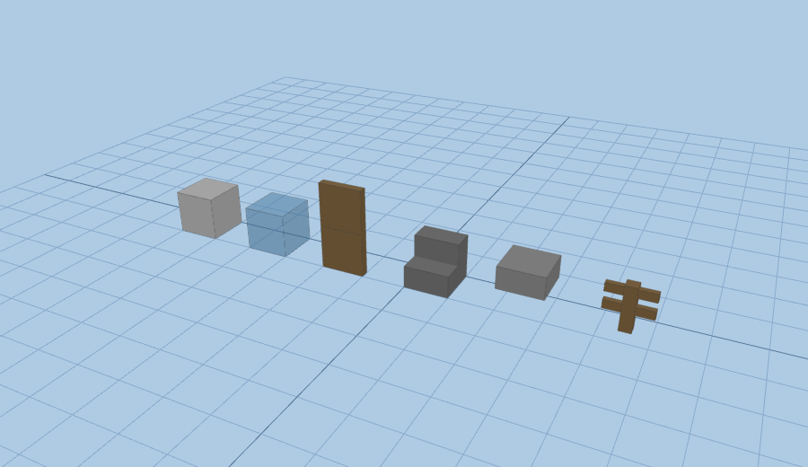

# Walkable browser renderers for the voxel building

The pipeline (PIPELINE.md) turns an IFC into a `blocks.csv` of Minecraft
block-states. Two ways to *walk through* that building in a browser are wired up
in this repo; this doc compares them and explains when to use which.

| | **BlockCraft** (`/blockcraft`) | **minecraft-web-client** (`/renderers/mcweb`) |
|---|---|---|
| what it is | a from-scratch WebGL voxel game (Three.js + Node), Apache-2.0, forked into this repo | a browser Minecraft client (MIT) built on the prismarine stack; renders **real vanilla block models** |
| doors | ❌ engine has none — we hand-added a flat `door_x/door_z` block family across the server registry, mesher, textures and player code | ✅ native `oak_door` block-state (facing / hinge / upper-lower / open) — nothing to add |
| stairs | ❌ cube-only — stairs are stepped `stonebrick` cubes | ✅ real `*_stairs` model (facing / half / shape) |
| slabs | ❌ none (full cubes) | ✅ real `*_slab` (top/bottom half-height) |
| railings | remapped (see BLOCKCRAFT.md) | ✅ real `oak_fence` post-and-rail (or any `*_fence`) |
| palette | must be **remapped** to the blocks BlockCraft ships | ✅ our Minecraft palette is used **verbatim** — same block-states WorldEdit/`.schem` use |
| how our data gets in | `export_blockcraft.py` → `building.json` (+ generated door textures) | `export_anvil.js` → a standard **Anvil world save** (`level.dat` + `region/*.mca`) |
| server needed | Node server + patched world-gen | none (singleplayer save) or optional proxy |
| weight | light, fast, chunky | heavier (full protocol/physics), most faithful |
| upstream | [ChiefElite/blockcraft-public](https://github.com/ChiefElite/blockcraft-public) | [zardoy/minecraft-web-client](https://github.com/zardoy/minecraft-web-client) — **maintenance-only**, but live (1.8–1.21.x) |

**Short version:** BlockCraft is the lightweight, self-hosted option that needs
no Minecraft assets; minecraft-web-client is the higher-fidelity option where
doors, stairs, slabs and fences render as real Minecraft models with **zero
engine patching**, because it understands vanilla block-states directly.

## Why the fidelity difference exists

BlockCraft is a *cube-only voxel engine*: it has no concept of a block model, so
every non-cube feature (a door leaf, a stair profile, a half-slab, a railing)
has to be faked or dropped. Everything in the BlockCraft column marked ❌ is a
symptom of that, and each one we "fixed" for BlockCraft is a hand-written patch
in the tracked fork (see BLOCKCRAFT.md → *Licensing & our changes*).

minecraft-web-client is the opposite: it loads the actual vanilla block models
and renders them from block-**states**. Our pipeline already emits real
block-states (`minecraft:oak_door[facing=…,half=…]`, `*_stairs[…]`,
`*_slab[type=…]`, stained glass, `oak_fence`), so they render correctly with no
mapping. That is the whole reason to add it as a second renderer.

## The `/renderers/mcweb` tooling

Built on the **same prismarine libraries minecraft-web-client uses to load a
world** (`prismarine-chunk`, `prismarine-provider-anvil`), so compatibility is
guaranteed by construction. (We use Node/prismarine rather than Python/amulet
for exactly this reason — and because amulet's native deps don't build here.)

| file | what |
|---|---|
| `export_anvil.js` | `blocks.csv` → Anvil world save; keeps every block-state verbatim, optional flat grass ground, writes `level.dat` |
| `verify_save.js` | loads the save back through `prismarine-provider-anvil` (the client's own loader) and asserts doors/stairs/slabs/glass/fence block-states survived |
| `run.sh` | `export` / `verify` / `pack` / `all` convenience driver |
| `render/` | headless three.js render that bakes the **real vanilla models** for the exported block-states and screenshots them — the reproducible proof that shapes render (not cubes) |
| `fixtures/demo_house.py` | a tiny hand-authored `blocks.csv` (same schema as the pipeline) exercising every shape, so the renderer can be verified without an IFC |
| `docs/demo_render.png` | the render below |

### Quick start

```sh
cd renderers/mcweb
npm install

# from a pipeline blocks.csv (or the bundled demo fixture):
python3 fixtures/demo_house.py > /tmp/demo.csv
./run.sh all /tmp/demo.csv /tmp/demo_world     # export + verify + zip

# load it: open https://mcraft.fun  ->  Menu -> Open World  ->  drop demo_world.zip
#          walk with WASD; right-click a door to open it.
```

For a real building, point it at the pipeline output:

```sh
./run.sh all ../../out/unbc_1m/blocks.csv ../../out/unbc_1m/world
```

### Verified

`verify_save.js` round-trips the exported save through the client's own Anvil
loader and reports which shapes survived. On the **real UNBC building** (`make
p1` → 167,585 blocks, 375 chunks):

```
PASS  functional doors round-trip  (halves=lower/upper, facings=east/south)
  --   real stair block-states: absent in this model
  --   real slabs: absent in this model
PASS  fence railings: 2409 blocks
PASS  stained-glass glazing: 2710 blocks
all required checks passed
```

and on the **demo fixture** (which exercises every shape the exporter handles):

```
PASS  functional doors round-trip  (halves=lower/upper, facings=north)
PASS  real stair block-states: 2 blocks
PASS  real slabs: 49 blocks
PASS  stained-glass glazing: 19 blocks
all required checks passed
```

### What the current pipeline emits (and the stairs/slabs gap)

The **exporter and renderer fully support** real stairs and slabs — the demo
fixture proves both round-trip and render (see the image below). But the
**voxelizer** (`scripts/ifc_to_voxels.py`) doesn't emit them yet: it maps
`IfcStair → minecraft:stone_bricks` (cubes) and floors → `minecraft:smooth_stone`
(cubes), a carry-over from the cube-only BlockCraft era. So a real building
currently renders stairs as stepped stone-brick cubes here too — *not* an
exporter limit. Emitting true `*_stairs[facing,half,shape]` / `*_slab[type]`
block-states needs per-cell orientation from the voxelizer; it's the natural
next enhancement now that a renderer can display them. (Doors, glass, concrete
and the new `oak_fence` railings already flow through as real block-states.)

`render/` bakes the **real vanilla block models** for those states and
renders them headlessly (Chromium/WebGL — the same three.js pipeline the client
uses). Left→right: concrete cube, translucent glass, a **thin two-high door
panel**, a **stepped stair**, a **half-height slab**, and a **post-and-rail
fence** — none of which BlockCraft can draw:



## Other renderers considered (not wired up)

- **deepslate / lodestone** — libraries that render Minecraft *structures* with
  real block models in the browser. Best *lightweight* option if you only need
  an accurate view (it's what misode's tools use), but it's an orbit-camera
  viewer, **not walkable** — so it doesn't replace either renderer above.
- **prismarine-viewer** — the rendering engine *underneath* minecraft-web-client;
  useful for headless/spectator renders, not a full walkable client on its own.
- **Eaglercraft** — a real Minecraft Java port to the browser; walkable and
  fully faithful, but it's decompiled-MC (licensing grey area) — avoid for a
  research/BIM deliverable.

## Licensing

minecraft-web-client is **MIT**. Unlike BlockCraft, we do **not** fork or vendor
it — `/renderers/mcweb` only produces a standard Anvil world save and loads it in
the upstream client (hosted or a local `git clone` + build), so there is nothing
of theirs to relicense here.
